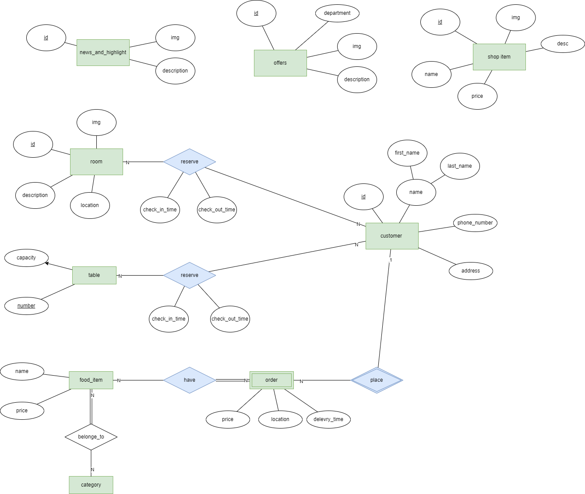

# Requirements

## User Stories

- As a user, I want to be able to see the whole site in both Arabic and English.
- As a user, I want to reserve a room in the boutique.
- As a user, I want to see the menu of the restaurant.
- As a user, I want to see the items in the shop.
- As an admin, I want to be able to change the offers.
- As an admin, I want to be able to add rooms.
- As an admin, I want to be able to add reservations to a room.

## Software Requirements

|                   |frontend req                        |Admin req|
|:----              |:----                               |:----|
|whole site         |- bilingual| |
|                   |- bot|
|Home Page          |- show all other pages              |- change the offers|
|                   |- show some highlights and news     |- change news|
|                   |- show offers|
|                   |- about us|
|                   |- map (location)                    |
|                   |- google review link                |
|Boutique  Page     |- show all Rooms                    |- can add rooms|
|                   |- has 360 views of the rooms        |- show the form submissions|
|                   |- form to see who is intersted      |- add reservations to a room|
|                   |- call to check in a room           |- calendar to show all the reservation|
|                   |                                    |- print all reservation|
|Resturant Page     |- show the menu as a form and select whatever you want then submit it|- crud menu item|
|                   |                                    |- show all the reservation|
|Shop Page          |- show the item in the shop            |- crud shop item|
|Tourism Page       |- show some toursim place in 'al-salt'| |

## DB Modeling
### ERM Digram

### Models

#### shared models

`news_and_highlight` (id, img, desc)

`offer` (id, img, desc, department)

`customer` (id, name,firstn_name,last_name,address, phone_number)

#### boutique app

`room` (id, desc, location, img)

`reserve` (custumer_id, room_id, check_in_time,check_out_time)

#### restaurant app

`table` (id, capacity)

`food_item` (id, name,price)

`order` (id, customer_id, delevry_time, location, price,create_time)

`reserve` (custumer_id, table_id, check_in_time,check_out_time)

`order_have` (order_id, foo_id)

`category` (name)

`food_category`(category_name, food_id)

#### shop app

`shop_item` (id, name,desc, img,price)
